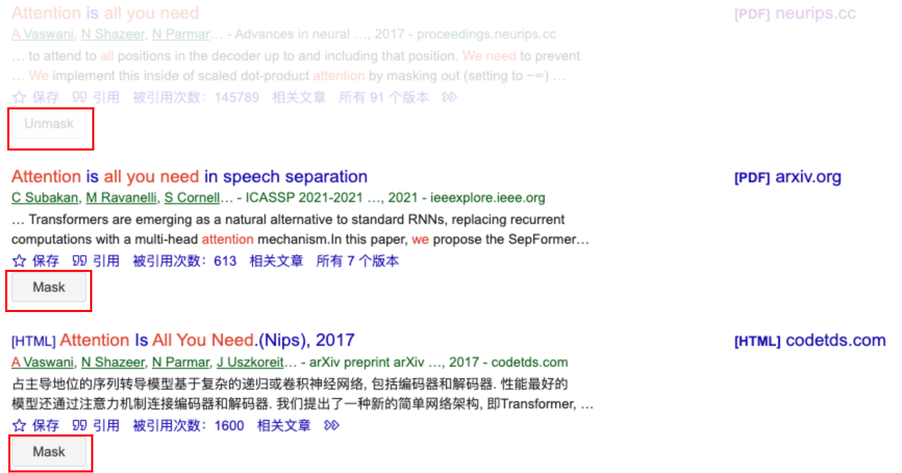

Mask articles that you don't want to read in Google Scholar.

# Usage
1. Click `Mask` or `Unmask` button to toggle the mask status of articles.
The mask status will be saved in your browser's local storage and if you refresh the page, the mask status still exists.

2. Click `Export` or `Import` button to export or import the mask status of articles.
If you wish to share the mask status with other devices, you can export the mask status and import it on them.
